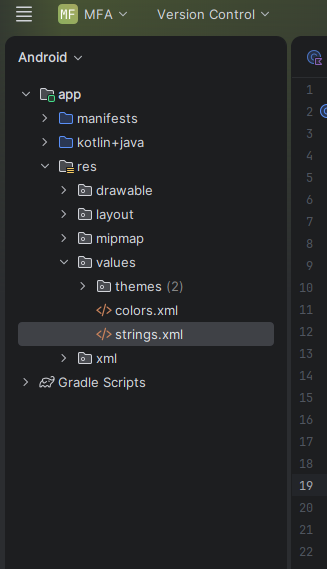

МИНИСТЕРСТВО НАУКИ И ВЫСШЕГО ОБРАЗОВАНИЯ РОССИЙСКОЙ ФЕДЕРАЦИИ
ФЕДЕРАЛЬНОЕ ГОСУДАРСТВЕННОЕ БЮДЖЕТНОЕ ОБРАЗОВАТЕЛЬНОЕ УЧРЕЖДЕНИЕ ВЫСШЕГО
ОБРАЗОВАНИЯ\
«САХАЛИНСКИЙ ГОСУДАРСТВЕННЫЙ УНИВЕРСИТЕТ»

Институт естественных наук и техносферной безопасности\
Кафедра информатики\
Бычков Дмитрий

Лабораторная работа №1\
«Создание первого проекта в Android Studio. Запуск на эмуляторе. Обзор
интерфейса»

Научный руководитель\
Соболев Евгений Игоревич

Южно-Сахалинск\
2026

Цель работы: Ознакомиться с интефейсом android studio, ознакомиться с
основами структуры проекта, с запуском приложения на эмуляторе и на
устройстве.

Скриншот созданного проекта в Android Studio
(структура проекта):\

Скриншот работающего приложения на устройстве\
\
Листинг файла **activity_main.xml** с изменениями (если выполнялось инд.
задание).
```kotlin
\<?xml version=\"1.0\" encoding=\"utf-8\"?\>

\<androidx.constraintlayout.widget.ConstraintLayout
xmlns:android=\"http://schemas.android.com/apk/res/android\"

xmlns:app=\"http://schemas.android.com/apk/res-auto\"

xmlns:tools=\"http://schemas.android.com/tools\"

android:id=\"@+id/main\"

android:layout_width=\"match_parent\"

android:layout_height=\"match_parent\"

tools:context=\".MainActivity\"\>

\<TextView

android:layout_width=\"wrap_content\"

android:layout_height=\"wrap_content\"

android:text=\"@string/greeting\"

app:layout_constraintBottom_toBottomOf=\"parent\"

app:layout_constraintEnd_toEndOf=\"parent\"

app:layout_constraintStart_toStartOf=\"parent\"

app:layout_constraintTop_toTopOf=\"parent\" /\>

\<TextView

android:layout_width=\"wrap_content\"

android:layout_height=\"wrap_content\"

android:text=\"@string/greeting\"

android:textSize=\"24sp\"

android:textColor=\"@color/material_on_background_emphasis_high_type\"

android:layout_marginTop=\"67dp\"

app:layout_constraintBottom_toBottomOf=\"parent\"

app:layout_constraintEnd_toEndOf=\"parent\"

app:layout_constraintStart_toStartOf=\"parent\"

app:layout_constraintTop_toTopOf=\"parent\" /\>

\</androidx.constraintlayout.widget.ConstraintLayout\>
```
Ответы на контрольные вопросы.

1\. Какие основные компоненты входят в структуру Android-проекта?

Стандартный проект созданный в Android Studio имеет в себе: manifests --
файлы конфигураций,\
java/ или kotlin/, в зависимости от языка, res\| - ресурсы приложения,
Gradle scripts -- файлы сборки проекта

2 Для чего нужен файл AndroidManifest.xml?

AndroidManifest.xml -- основной файл конфигурации приложения. Выполняет
следующие функции: Указывает имя пакета, который служит уникальным
идентификатором приложения, Описывает все компоненты приложения,
указывает какие разрешения нужны приложению, объявляет требования к
оборудованию.

3\. Чем отличается minSdkVersion от targetSdkVersion?

Minsdkversion -- минимальная версия android, на которой приложение может
быть установлено и запущенно, targetsdkversion --- версия для которой
предназначено приложение.

4 Что такое AVD и для чего он используется?

****AVD (Android Virtual Device)**** ---  это конфигурация виртуального
Android-устройства, которая запускается в эмуляторе Android Studio.


