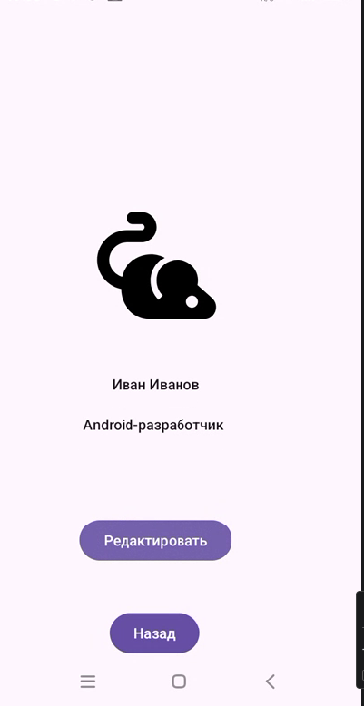
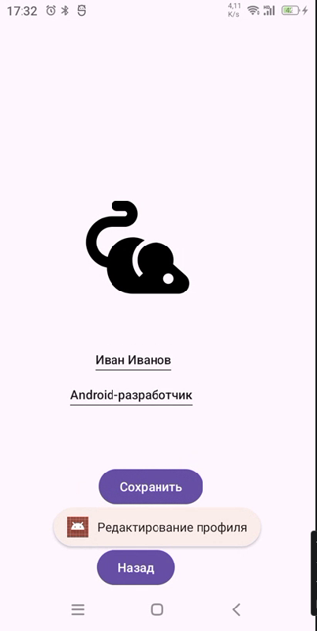

<div align="center">

**МИНИСТЕРСТВО НАУКИ И ВЫСШЕГО ОБРАЗОВАНИЯ РОССИЙСКОЙ ФЕДЕРАЦИИ**  
**ФЕДЕРАЛЬНОЕ ГОСУДАРСТВЕННОЕ БЮДЖЕТНОЕ ОБРАЗОВАТЕЛЬНОЕ УЧРЕЖДЕНИЕ ВЫСШЕГО ОБРАЗОВАНИЯ**  
**«САХАЛИНСКИЙ ГОСУДАРСТВЕННЫЙ УНИВЕРСИТЕТ»**

<br>
<br>

Институт естественных наук и техносферной безопасности  
Кафедра информатики  
Бычков Дмитрий Николаевич

<br>
<br>
<br>
<br>

Лабораторная работа №4
Верстка экрана профиля пользователя (аватар, имя, кнопка «Редактировать»)
01.03.02 Прикладная математика и информатика  
3 Курс

<br>
<br>
<br>
<br>
<br>
<br>
<br>
<br>
<br>
<br>
<br>
<br>
<br>

<div align="right">
Научный руководитель<br>
Соболев Евгений Игоревич
</div>

<br>
<br>
<br>

г. Южно-Сахалинск  
2026 г.

</div>


<br>
<br>
Листинг Activity_main
<br>

```xml
<?xml version="1.0" encoding="utf-8"?>
<androidx.constraintlayout.widget.ConstraintLayout xmlns:android="http://schemas.android.com/apk/res/android"
    xmlns:app="http://schemas.android.com/apk/res-auto"
    xmlns:tools="http://schemas.android.com/tools"
    android:id="@+id/main"
    android:layout_width="match_parent"
    android:layout_height="match_parent"
    tools:context=".MainActivity">

    <ImageView
        android:id="@+id/avatar"
        android:layout_width="141dp"
        android:layout_height="185dp"
        android:layout_marginTop="156dp"
        android:layout_marginEnd="132dp"
        app:layout_constraintEnd_toEndOf="parent"
        app:layout_constraintTop_toTopOf="parent"
        app:srcCompat="@drawable/ic_profile" />

    <TextView
        android:id="@+id/name"
        android:layout_width="wrap_content"
        android:layout_height="wrap_content"
        android:layout_marginTop="356dp"
        android:layout_marginEnd="160dp"
        android:text="@string/profile_name"
        android:textAppearance="@style/TextAppearance.AppCompat.Body2"
        app:layout_constraintEnd_toEndOf="parent"
        app:layout_constraintTop_toTopOf="parent" />

    <TextView
        android:id="@+id/stat"
        android:layout_width="wrap_content"
        android:layout_height="wrap_content"
        android:layout_marginTop="396dp"
        android:layout_marginEnd="136dp"
        android:text="@string/profile_status"
        android:textAppearance="@style/TextAppearance.AppCompat.Body2"
        app:layout_constraintEnd_toEndOf="parent"
        app:layout_constraintTop_toTopOf="parent" />

    <EditText
        android:id="@+id/nameED"
        android:layout_width="wrap_content"
        android:layout_height="wrap_content"
        android:layout_marginTop="356dp"
        android:layout_marginEnd="160dp"
        android:text="@string/profile_name"
        android:textAppearance="@style/TextAppearance.AppCompat.Body2"
        android:visibility="gone"
        app:layout_constraintEnd_toEndOf="parent"
        app:layout_constraintTop_toTopOf="parent" />

    <EditText
        android:id="@+id/statED"
        android:layout_width="wrap_content"
        android:layout_height="wrap_content"
        android:layout_marginTop="396dp"
        android:layout_marginEnd="136dp"
        android:text="@string/profile_status"
        android:textAppearance="@style/TextAppearance.AppCompat.Body2"
        android:visibility="gone"
        app:layout_constraintEnd_toEndOf="parent"
        app:layout_constraintTop_toTopOf="parent" />

    <Button
        android:id="@+id/redact"
        android:layout_width="wrap_content"
        android:layout_height="wrap_content"
        android:layout_marginTop="496dp"
        android:layout_marginEnd="128dp"
        android:text="@string/button_edit"
        app:layout_constraintEnd_toEndOf="parent"
        app:layout_constraintTop_toTopOf="parent" />

    <Button
        android:id="@+id/back"
        android:layout_width="wrap_content"
        android:layout_height="wrap_content"
        android:layout_marginTop="588dp"
        android:layout_marginEnd="160dp"
        android:text="@string/back_button"
        app:layout_constraintEnd_toEndOf="parent"
        app:layout_constraintTop_toTopOf="parent" />
</androidx.constraintlayout.widget.ConstraintLayout>
```
<br>
<br>
Листинг Activity_main
<br>
```kotlin
package com.example.mta3

import android.os.Bundle
import android.view.View
import androidx.activity.enableEdgeToEdge
import androidx.appcompat.app.AppCompatActivity
import androidx.core.view.ViewCompat
import androidx.core.view.WindowInsetsCompat
import android.widget.Button
import android.widget.EditText
import android.widget.TextView
import android.widget.Toast


class MainActivity : AppCompatActivity() {
    var IsEditing =false
    fun editing()
    {
        Toast.makeText(this, R.string.toast_message, Toast.LENGTH_SHORT).show()
        findViewById<EditText>(R.id.nameED).visibility = View.VISIBLE
        findViewById<EditText>(R.id.statED).visibility = View.VISIBLE
        findViewById<TextView>(R.id.name).visibility = View.GONE
        findViewById<TextView>(R.id.stat).visibility = View.GONE
        findViewById<Button>(R.id.redact).text = getText(R.string.save_button)
        IsEditing = !IsEditing
    }
    fun saving()
    {
        val newname = findViewById<EditText>(R.id.nameED).text
        val newstat = findViewById<EditText>(R.id.statED).text
        findViewById<EditText>(R.id.nameED).visibility = View.GONE
        findViewById<EditText>(R.id.statED).visibility = View.GONE
        findViewById<TextView>(R.id.name).visibility = View.VISIBLE
        findViewById<TextView>(R.id.stat).visibility = View.VISIBLE
        findViewById<TextView>(R.id.name).text = newname
        findViewById<TextView>(R.id.stat).text = newstat
        findViewById<Button>(R.id.redact).text = getText(R.string.button_edit)
        IsEditing = !IsEditing
    }
    override fun onCreate(savedInstanceState: Bundle?) {
        super.onCreate(savedInstanceState)
        enableEdgeToEdge()
        setContentView(R.layout.activity_main)
        ViewCompat.setOnApplyWindowInsetsListener(findViewById(R.id.main)) { v, insets ->
            val systemBars = insets.getInsets(WindowInsetsCompat.Type.systemBars())
            v.setPadding(systemBars.left, systemBars.top, systemBars.right, systemBars.bottom)
            insets
        }
        val buttonEdit = findViewById<Button>(R.id.redact)
        buttonEdit.setOnClickListener {
            if (!IsEditing)
            {
                editing()
            }
            else
            {
                saving()
            }
        }

        val buttonBack = findViewById<Button>(R.id.back)
        buttonBack.setOnClickListener {
            finish()
        }
    }
}
```
Скриншоты
<br>

<br>

<br>
Ответы на контрольные вопросы
# Краткий ответ по ConstraintLayout и основам Android

## 1. ConstraintLayout vs LinearLayout
- **ConstraintLayout** — гибкая компоновка с ограничениями (constraints), позволяет создавать сложные UI с плоской иерархией.
- **Преимущества**:
  - Уменьшает вложенность → выше производительность.
  - Гибкое позиционирование (относительно родителя или других элементов).
  - Поддержка цепочек (chains), барьеров (barriers), направляющих (guidelines).
<br>
## 2. Атрибуты `app:layout_constraint...`
- Задают ограничения для позиционирования элемента.
- Примеры:
  ```xml
  app:layout_constraintTop_toTopOf="parent"
  app:layout_constraintStart_toEndOf="@id/otherView"
  app:layout_constraintBottom_toBottomOf="parent"
<br>
## 3. Как вынести размеры и цвета в ресурсы? Зачем это нужно?
в файле res/values/dimens.xml
```xml
<dimen name="button_width">120dp</dimen>
```
в файлe colors.xml
```xml
<color name="primary">#FF6200EE</color>
```
Зачем:
Единообразие стилей.
Удобство поддержки и переиспользования.
Поддержка разных конфигураций (темы, экраны).
<br>
## 4. Каким образом можно обработать клик на кнопке в Kotlin-коде?
```kotlin
// Вариант 1: setOnClickListener с лямбдой
val button = findViewById<Button>(R.id.my_button)
button.setOnClickListener { /* действия */ }

// Вариант 2: через View Binding
binding.myButton.setOnClickListener { /* действия */ }

// Вариант 3: атрибут android:onClick в XML
fun onButtonClick(view: View) { /* действия */ }
```
## 5. Как добавить обработчик нажатия на ImageView?
```kotlin
val imageView = findViewById<ImageView>(R.id.my_image)
imageView.isClickable = true   // или android:clickable="true" в XML
imageView.setOnClickListener { /* реакция */ }
```

<br>
Вывод:
Получены навыки работы с ресурсами разных типов,
Основы в работы с constraint layout,
Работа с обработчиком событий в kotlin
